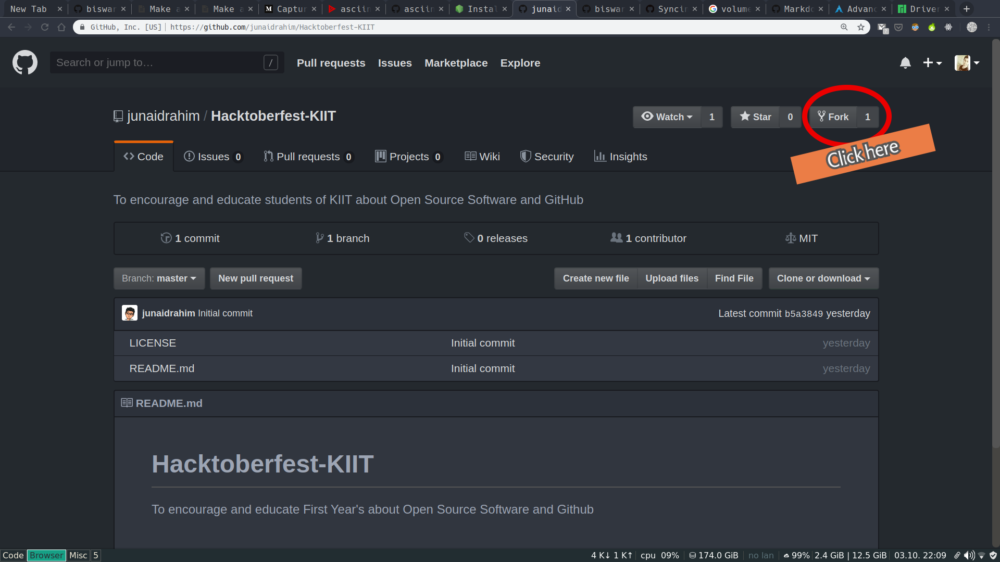
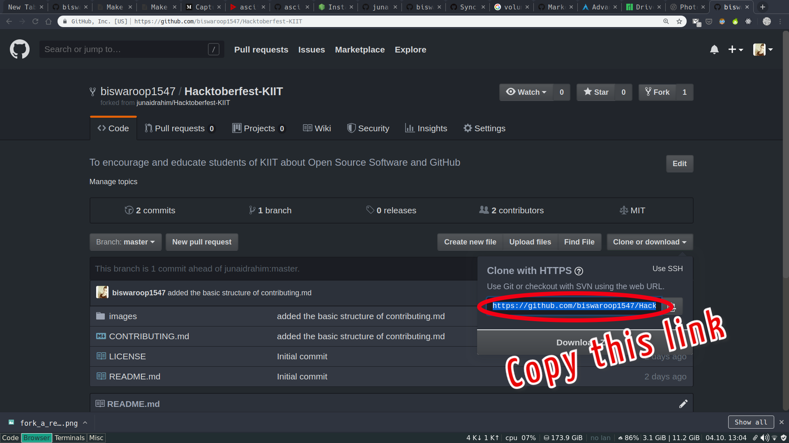
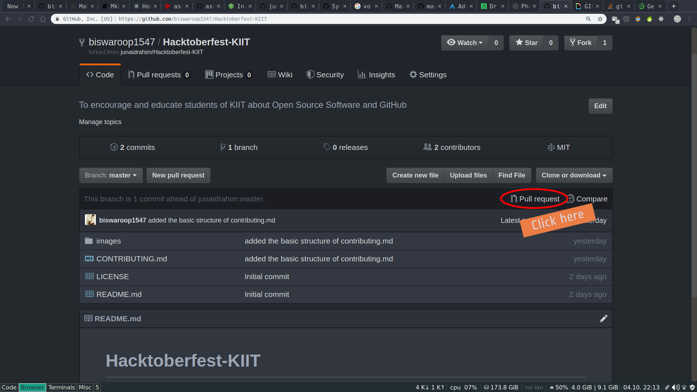
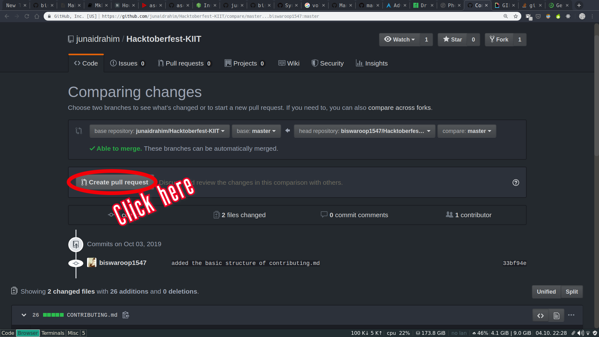

<p align="center">
    
</p>


# A Guide to making your first Pull Request

## Requirements

1. An account on [github.com](https://www.github.com)
2. git
3. A curious mind

> Go ahead and get yourself an account on [github.com](https://www.github.com)

* If you're on windows, download git from https://git-scm.com/downloads
* If you're on Ubuntu, run `sudo apt install git`

Here's a great tutorial on git and github, make sure you know the basics of git before moving ahead.
https://www.youtube.com/watch?v=SWYqp7iY_Tc&t=1348s


<br></br>
## **Fork the repository and clone it**

### Copy the link from your forked repository



### Clone the repository
```bash
git clone <enter_your_copied_url>
cd Hacktoberfest-KIIT
```

To know more about cloning and forking a repository check [this](https://help.github.com/en/articles/fork-a-repo) out!
<br></br>
## Make a directory inside by your name 
```bash
mkdir <your_name>
cd <your_name>
```
### **Put your programs inside**
>#### *Note: Put your programs inside the directory of your name only*
---
#### ``` Then commit and push your changes```
#### Inside the Hactoberfest-KIIT directory -
---
* ***Do this once, only for the first time***
```bash
git remote add upstream https://github.com/junaidrahim/Hacktoberfest-KIIT.git
``` 
---
```bash
git add .
git commit -m "enter what you added or changed"
```

To know more about making commits check out [this](https://help.github.com/en/articles/pushing-commits-to-a-remote-repository) link
### **Sync your forked repository with the original repository**
> To avoid merge conflicts and make clean pull requests
```bash
git fetch upstream
git checkout master
git rebase upstream/master
```
To know more about syncing a fork check out [this](https://help.github.com/en/articles/syncing-a-fork) awesome link by github
***
### **Push the changes to your forked repository**
```bash
git push -f origin master
```
***
<br></br>


## **Make a pull request**

*click on pull request in your forked repository*


<br></br>

*then click on create pull request*



***Now the owner of the repository will accept your pull request and merge changes with the original repository*** 

To know more about making a pull request check out [this](https://help.github.com/en/articles/creating-a-pull-request) link
***
<br></br>


## **Win T-shirt, stickers and other cool stuffs!!**
###  Congrats!!!! for making your contribution towards open source, now make 4 pull requests and get ready to win those awesome hacktoberfest rewards 

***Get all the details about hacktoberfest from [here](https://hacktoberfest.digitalocean.com/)!***

*To know more about contributing to open source check out [this](https://opensource.guide/how-to-contribute/) awesome guide!*


