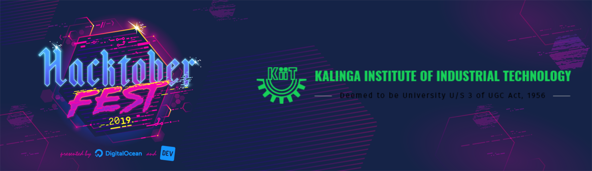

# Hacktoberfest-KIIT

It's that time of the year again. Hacktoberfest 2019 is here. Support Open Source and win a free t-shirt

## What is Hacktoberfest ?

Hacktoberfest is a month long virtual fest organized by Digital Ocean to encourage and celebrate Open Source Software.
Hacktoberfest runs for the entire month of October, all you have to do is create 5 pull requests on github 
and Digital Ocean will send you a cool t-shirt and a lot of stickers. 
Hacktoberfest is one of the easiest ways for students to start contributing to Open Source.

## What is Open Source Software ?

Open Source Software is software whose source code is publically available. 

Anyone and everyone has the right to copy and modify source code that is Open Source, thus anyone is free to add / modify features
and help in constantly improving that piece of code.
Open source technology and open source thinking both benefit programmers and non-programmers.
Open Source philosophy encourages collaboration on a global level. Some of the greatest software of all time is a result of
constant collaboration with some of the most awesome people in the world. 

## Why is it amazing ?

It is important for people new into the world of programming and software development to understand the importance 
of Open Source and giving back to the community. 

No matter what your skill level, Hacktoberfest is an awesome way to get into using the workflow of git and github and undestand how Open Source development works. 
Hacktoberfest is open to everyone in the Global Community, anyone and everyone is eligible to make contributions and win the t-shirt.

You can read more about Hacktoberfest on [hacktoberfest.digitalocean.com](https://hacktoberfest.digitalocean.com/)

## How do I get my t-shirt ?

